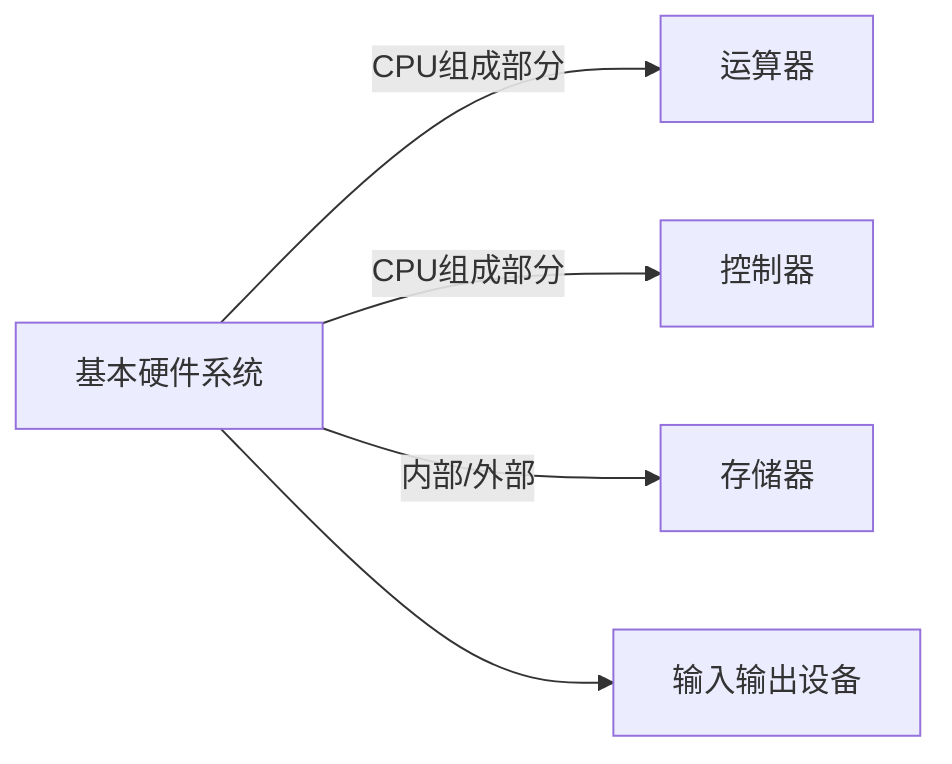

# 计算机系统基础知识
## 基础知识
### 计算机硬件组成: 

**CPU：**
由运算器、控制器、寄存器和内部总线等组成。负责程序控制、操作控制、时间控制与数据处理等。
1. 运算器：算术逻辑单元（ALU）、累加寄存器（AC）、数据缓冲寄存器（DR）和状态条件寄存器（PSW）等组成。用于完成算术与逻辑运算，受控制器命令而进行动作
2. 控制器：用于控制整个CPU工作，包括指令控制逻辑、时序控制逻辑、总线控制逻辑和控制逻辑等操作，主要部件有指令寄存器（IR）、程序计数器（PC）、地址寄存器（AR）和指令译码器（AR）。
3. 存储器：
4. 输入设备：

### 计算机数据表示：
1. 机器数：计算机中各种数值的表现形式，采用二进制计数制（0和1表示），其对应的实际数值成为数的真值。
2. 机器数的编码方法：
* 原码：
* 反码：
* 补码：
* 移码：

### 校验码：

## 计算机体系结构
**1. 基本概念**

- **定义：** 计算机体系结构由结构、组织、实现、性能4个基本方面组成。其中结构指计算机系统各种硬件的互连，组织指各种部件的动态联系与管理，实现指各模块设计的组装完成，性能指计算机系统的 行为表现。
- **结构、组织与实现：**  计算机体系结构是指计算机的概念性结构和功能属性；计算机组织是指计算机体系结构的逻辑实现，包括机器内的数据流和控制流的组成以及逻辑设计等（计算机组成原理）；计算机实现是指计算机组织的物理实现。

**2. 分类**

- 宏观上：按照处理机的数量分为单处理系统、并行处理系统和分布式处理系统。
- 微观上：按照并行程度分类，有Flynn分类法、冯泽云分类法、Handler分类法和Kuck分类法。

**3. 指令系统**

- 定义：一个处理器支持的指令和指令的字节级编码称为其指令集体系结构（ISA）。不同的处理器祖因为支持不同的指令体系结构导致程序被编译在一种机器上运行而不能在另一台机器上运行。
- 分类：

    （1）操作数在CPU中的存储方式；
    （2）显示操作数的数量；
    （3）操作数的位置；
    （4）指令的操作；
    （5）操作数的类型与大小。

- 按照暂存机制分类，根据CPU内部存储操作数的区别，可以把指令体系分为3类：堆栈（Stack）、累加器（Accumulator）和寄存器组（a set of Registers）.
- CISC和RISC 

  
    CISC，全称Complex Instruction Set Computer，复杂指令集计算机，基本思想是进一步增强原有指令的的功能用更为复杂的新指令取代原先由软件子程序完成的功能。
    RISC，全称Reduced Instruction Set Computer，精简指令集计算机，基本思想是通过减少指令总数和简化指令功能降低硬件设计的复杂度，使指令能单周期执行，并通过优化编译提高指令的执行速度，采用硬布线控制逻辑优化编译程序。
    
    CISC缺点：指令集过分庞杂；需要多个CPU周期；编译程序冗长复杂；动作繁多、设计复杂和研制周期长；芯片种类多导致出错几率大，成本较高，成品率较低。
    
    RISC的关键技术：重叠寄存器窗口技术；优化编译技术；超流水以及超标量技术；硬布线逻辑与微程序相结合。
    

**4. 处理机** 

- 包括阵列处理机、并行处理机和多处理机
- 并行性包括同时性和并发性，同时性是指两个或两个以上的时间在同一时刻发生，并发性是指两个或两个以上的事件在同一时间间隔内连续发生。
- 并行处理：

    1.存储器操作并行；
    2.处理器操作步骤并行；
    3.处理器操作并行；
    4.指令、任务、作业并行（多处理机、分布式处理系统和计算机网络等）。

## 计算机存储 
**1. 存储器的结构** 

CPU内部通用寄存器、Cache、主存储器、联机磁盘存储器、脱机光盘和磁盘存储器。

**2. 存储器分类** 

包括了CPU内部的通用寄存器组、CPU内的Cache（高速缓存）、CPU外部的Cache、主板上的主存储器、主板外的联机磁盘存储器以及脱机的磁带存储器和光盘存储器等。

- 按照存储位置分类：

  
    内存：也称为主存，用来存储当前需要的程序和数据，容量下、速度快。
    外存：也称为辅存，用来存放当前不参加运行的大量信息，需要时调入内存中。
    
- 按照结构材料分类：

    磁存储器：磁性介质做成的。
    半导体存储器：
    光存储器：

- 按照工作方式分类：

  
    读/写存储器：RAM，既能读取也能存入。
    只读存储器：
        固定只读存储器：ROM，出厂时写好数据，只能读出不能改变。
        可编程只读存储器：PROM，可以由用户一次性写入，写入后不可修改。
        可擦出可编程只读存储器：EPROM，可以读取也可以写入，但必须先擦除采用特殊设备写入。
        电擦除可编程只读存储器：
        闪速存储器：

- 按照访问方式分类：

**4.高速缓存**

1. 概念：用来存放当前最活跃的程序和数据。
2. 特点：

-  位于主存和CPU之间；
-  大小一般在几千字节到几兆字节之间。
-  速度比主存快5-10倍，由快速半导体存储器构成；
-  其内容是主存局部域的副本，对程序员来说是透明的。

3. 组成：

高速缓存Cache存储器用来存放主存的**部分**拷贝(**副本**)信息。控制部分的功能是判断CPU要访问的信息是否存在Cache存储器中，若命中直接对Cache存储器进行寻址；若未命中则按照替换原则决定主存的一块信息放到Cache存储器的哪一块里。

4. 地址映射方法：

CPU工作时，送出的是主存单元的地址，而应从Cache存储器中读写信息，因此需要地址映射方法将主存地址映射成Cache存储器中的地址。

- 直接映像：主存的块与Cache的块的对应关系是固定的。
- 全相联映像：主存与Cache存储器均分成大小相同的块，允许主存的任一块可以调入Cache存储器的任何一个块的空间中。
- 组相联映像：将Cache块进行分组。

5. 替换算法：使Cache获得尽可能高的命中率。包括：

- 随机替换算法：使用随机数发生器产生一个要替换的块号，将该块替换出去；
- 先进先出算法：将最先进入的Cache信息块替换出去；
- 近期最少使用算法：将近期最少使用的Cache中的信息块替换出去；
- 优化算法：先执行一次程序，统计Cache的替换情况，通过这种先验信息，在第二次执行时可以有效的进行替换。

**5. 虚拟存储器**

