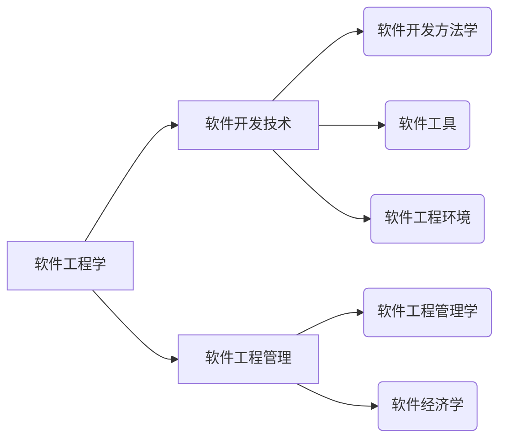

# 软件工程基础

## 软件工程概述

### 概述

1. 概念

> 软件工程是指应用计算机科学、数学及管理科学等原理，以工程化的原则和方法来解决软件问题的工程。

> **目的**：
> - 提高软件生成效率
> - 提高软件质量
> - 降低软件成本

2. 软件工程学

### 计算机软件

1. 概念

> 计算机软件是指计算机系统中的程序及其文档。
>> - 程序是计算任务的处理对象和处理规则的描述。
>>> 任何以计算机为处理工具的任务都是计算任务。
>>>
>>> 处理对象是数据（数字、文字、图形、图像、声音等，只是表示，无含义）或信息（数据及有关的含义）。
>>>
>>> 处理规则
>>
>> - 文档是为了便于了解程序所需的阐述性资料。

2. 计算机软件分类

- 系统软件
- 应用软件
- 工程/科学软件
- 嵌入式软件
- 产品线软件
- Web应用
- 人工智能软件
- 开放计算
- 网络资源
- 开源软件

3. 软件工程基本原理

- 用分阶段的生命周期计划严格管理
- 坚持进行阶段评审
- 实行严格的产品控制
- 采用现代程序设计技术
- 结果应能清楚地审查
- 开发小组人员应少而精
- 承认不断改进软件工程实践地必要性

### 软件生命周期

1. 可行性分析与项目开发计划

    - 定位：确定软件的开发目标和可行性。内容包括：问题定义、可行性分析、项目开发计划。用于明确解决的问题是什么，有哪些可行的解决办法，需要多少费用、资源、时间。
    - 人员：用户、项目负责人、系统分析师
    - 文档：可行性分析报告、项目开发计划。

2. 需求分析

    - 定位：准确地确定软件系统必须做什么，确定软件系统地功能、性能、数据和界面等要求，从而确定系统地逻辑模型。
    - 人员：用户、项目负责人、系统分析师
    - 文档：软件需求说明书

3. 概要设计

    - 定位：设计软件的结构，明确软件由哪些模块组成、确定模块间的层次结构和调用关系、设计总体数据结构和数据库结构。
    - 人员：系统分析师、软件设计师
    - 文档：概要设计说明书

4. 详细设计

    - 定位：针对模块进行具体描述，把各模块的功能描述转变为精确的、结构化的过程描述。
    - 人员：软件设计师、程序员
    - 文档：详细设计文档

5. 编码

    - 定位：开发程序代码，将详细设计的各模块的控制结构转变为计算机可接受的程序代码。
    - 人员：软件设计师、程序员
    - 文档：接口文档等

6. 测试

    - 定位：检查软件各个模块的功能，保证软件质量。
    - 人员：（测试）软件设计师或（测试）系统分析师
    - 文档：软件测试计划、测试用例、软件测试报告

7. 维护

    - 定位：软件生存周期中时间最长的阶段，为了修改错误、变更或拓展软件功能等。
    - 人员：运维工程师、技术支持工程师、软件设计师、程序员
    - 文档：

## 软件过程与软件过程模型

### 软件过程

1. 含义：

- 个体含义：软件产品或系统在生存周期中的某一类活动的集合。例如：软件开发过程、软件管理过程等。
- 整体含义：软件产品或系统在个体含义下所有软件过程的总体。
- 工程含义：解决软件过程的工程，应用软件的原则、方法来构造软件过程模型并结合软件产品的具体要求进行实例化以及在用户环境下的用作，以此进一步提高软件的生产率，降低成本。

2. 模型

- **能力成熟度模型**（软件过程能力成熟度模型，Capability Maturity Model of Software，**CMM**）

    - 初始级（Initial）
    - 可重复级（Repeatable）
    - 已定义级（Defined）
    - 已管理级（Managed）
    - 优化级（Optimized）

- **能力成熟度模型集成**（**CMMI**）

若干过程模型的综合和改进，是支持多个工程学科和领域的、系统的、一致的过程改进框架。
包括：
- 阶段式模型：类似于CMM，关注组织的成熟度。
    - 初始的：过程不可预测且缺乏控制。
    - 已管理的：过程为项目服务。
    - 已定义的：过程为组织服务。
    - 定量管理的：过程已度量和控制。
    - 优化的：集中过程改进。
- 连续式模型：关注每个过程域的能力。包括6各过程域能力等级，等级号为0~5。
    - CL0（未完成的）：过程域未执行或未得到CL1中定义的所有目标。
    - CL1（已执行的）：其共性目标是过程将可标识的输入工作产品转换成可标识的输出工作产品，以实现支持过程域的特定目标。
    - CL2（已管理的）：其共性目标集中于管理的过程和制度化。
    - CL3（已定义级的）：其共性目标集中于已定义的过程的制度化。
    - CL4（已定量管理的）：其共性目标集中于已定量管理的过程的制度化。
    - CL5（优化的）：使用量化（统计学）手段改变和优化过程域，以满足客户要求的改变和持续改进计划中的过程域的功效。

### 软件过程模型

软件过程模型习惯上也称为软件开发模型，它是软件开发全部过程、活动和任务的结构框架。典型的软件过程模型有：

- 瀑布模型
- 增量模型
- 演化模型（原型模型、螺旋模型）
- 喷泉模型
- 基于构件的开发模型和形式化方法模型

#### 瀑布模型

1. 含义：

瀑布模型是将软件生命周期中的各个活动规定为依线性顺序连接的若干阶段的模型，包括需求分析、设计、编码、测试、运行和维护。

2. 特点：

由前至后，相互衔接。以文档作为驱动，适用于软件需求很明确的软件项目的模型。

3. 优点：

- 容易理解
- 管理成本低
- 强调开发的阶段性早期计划及需求调查和产品测试

4. 缺点：

- 客户必须能够完整、正确和清晰的表达需求
- 在开始的2个或3个阶段，很难评估真正的进度状态
- 接近项目结束时，出现大量的集成和测试工作
- 直到项目结束前，都不能演示系统能力
- 需求和设计的错误只有到了项目后期才能被发现，对于项目风险的控制能力较弱，导致延期和开发费用超出预算

#### 增量模型

1. 含义：

增量模型假设可以将需求分段为一系列增量产品，每一个增量可以分别开发，采用随着日程时间的进展而交错的线性序列，每一个线性序列产生软件的一个可发布的“增量”。

2. 特点：

第一个增量往往是核心的产品。
客户对每个增量的使用和评估都作为下一个增量发布的新特征和功能。
每一个增量均发布一个可操作的产品。

3. 优点：

增量模型作为瀑布模型的一个变体，具有瀑布模型的所有优点。
其他优点：
- 第一个可交付的版本所需要的成本和时间很少；
- 开发由增量表示的小系统所承担的风险不大；
- 快速发布第一个版本可以减少用户需求的变更；
- 运行增量投资，即在项目开始时，可以仅对一个或两个增量投资。

4. 缺点：

- 如果没有对用户的变更要求进行规划，那么产生的初始增量可能会造成后来增量的不稳定；
- 如果需求不像早期思考的那样稳定和完整，那么一些增量可能就需要重新开发，重新发布；
- 管理发生的成本、进度和配置的复杂性可能超出组织的能力。

#### 演化模型（Evolutionary Model）

演化模型是**迭代**的**过程模型**，专门应对不断演变的软件产品的过程模型，使开发者能逐步开发出更完整的软件版本，适用于对软件需求缺乏准确认识的情况。典型的演化模型有：原型模型和螺旋模型。

##### 原型模型（Prototype Model）

1. 含义：

由于客户往往不能准确地表达未来系统地全面要求，开发者对要解决的应用问题模糊不清，同时用户可能会不断产生新的需求，导致需求的变更，需要利用快速的原型来满足需求的变更。
原型是预期系统的一个可执行版本，反映了系统性质的一个选定的子集，不必满足目标软件的所有约束。

分为：探索型原型、实验型原型和演化型原型。

探索型原型目的是要弄清楚目标的要求，确定所希望的特性，并探讨多种方案的可行性。
实验型原型的目的是验证方案或算法的合理性，是在大规模开发和实现前，用于考察方案是否合适、规格说明是否可靠等。
演化型原型目的是将原型作为目标系统的一部分，通过对原型的多次改进，逐步将原型演化成最终的目标系统。

2. 特点：

- 适合于用户需求不清=、需求经常变化的情况；
- 适用于系统规模不是很大、不太复杂的情况；

##### 螺旋模型（Spiral Model）

1. 含义：

螺旋模型是将瀑布模型和演化模型结合起来，并加入风险分析，弥补了两种模型的不足。

2. 特点：

- 每个螺旋周期分为制定计划、风险分析、实施工程和用户评估四个步骤；
    - 制定计划就是确定软件的目标，选定实施方案，明确项目开发的限制条件；
    - 风险分析就是分析所选的方案，识别风险并消除风险；
    - 实施工程就是实施软件开发，验证阶段性产品；
    - 用户评估就是评价开发工作，提出修正建议，建立下一个周期的开发计划。
- 强调风险分析，使开发人员和用户对每个演化层出现的风险有所了解；
- 适用于庞大、复杂并且具有高风险的系统。

3. 优点：

- 支持用户需求的动态变化，为用户参与软件开发的所有关键决策提供方便，有助于提高软件的适应能力；
- 为项目管理人员及时调整管理决策提供了便利，从而减低了软件开发的风险；

4. 缺点： 

- 需要开发人员具有相当丰富的风险评估经验和专门的知识；
- 过多的迭代次数会增加开发成本，延迟提交时间。

#### 喷泉模型

1. 含义：是一种以用户需求为动力、以对象作为驱动的模型，适合于面向对象的开发方法。

2. 特点：具有迭代性和间隙性，开发活动往往需要重复多次，在迭代过程中不断完善软件系统。无间隙是指开发活动（如分析、设计、编码等）之间没有明显的边界，允许各开发活动交叉、迭代的进行。

3. 优点：

- 可以提供软件项目的开发效率，节省开发时间

4. 缺点：

- 需要大量的开发人员
- 不利于项目管理
- 要求严格的管理文档，加大了审核的难度

#### 基于构件的开发模型

#### 统一过程模型

#### 敏捷方法

## 需求分析

### 软件需求

1. 含义：

软件需求是指用户对目标软件系统在功能、行为、性能、设计约束等方面的期望。

通常包括：
- 功能需求：做什么、何时做、在什么时候以及如何修改或升级
- 性能需求：存储容量限制、执行速度、响应时间、吞吐量等技术性指标
- 用户或人的因素：用户的类型，例如用户对计算机的熟练程度、需要接受的训练、理解和使用系统的难度、错误操作系统的可能性
- 环境需求：未来软件应用的环境，包括硬件和软件方面。对硬件设备的需求包括机型、外设、接口、地点、分布、湿度、磁场干扰等；对软件的需求包括操作系统、网络和数据库等。
- 界面需求：系统输入与输出、对数据格式的特殊规定、对数据存储介质的规定
- 文档需求：需要哪些文档以及文档针对哪些读者
- 数据需求：数据格式、接收与发送数据的频率、数据的准确性和精度、数据流量、数据保持时间
- 资源使用需求：软件运行所需要的数据、其他软件、内存空间等资源；软件开发和维护所需要的人力、支撑软件、开发设备
- 安全保密需求：对访问系统或系统信息加以控制，隔离用户数据的方法，用户程序如何与其他程序、操作系统隔离以及系统备份要求等
- 可靠性需求：系统是否必须检测和隔离错误、出错后重启系统的允许时间
- 软件成本消耗与开发进度需求：开发是否有规定的时间表、软硬件投资有无限制
- 其他非功能性要求：采用何种开发模式、确定质量控制标准、里程碑和评审、验收标准、各种质量要求的优先级、可维护性方面的要求

需求来源：
- 用户
- 用户的规约
- 应用领域的专家
- 相关技术标准和法规
- 原有系统
- 原有系统的用户
- 新系统的潜在用户
- 竞争对手的产品

### 需求分析原则

1. 必须能够表示和理解问题的信息域
2. 必须能够定义软件将完成的任务
3. 必须能够表示软件的行为
4. 必须能够划分描述数据、功能和行为的模型，从而可以层次地揭示细节
5. 分析过程应该从要素信息移向细节信息

### 需求工程

1. 含义：

需求工程是一个不断反复地需求定义、文档记录、需求演进地过程，并最终在验证地基础上冻结需求。

2. 阶段：

- **需求获取**：与用户交流、对现有系统观察、对任务进行分析，确定系统或产品范围地限制性描述、与系统或产品有关的人员及特征列表、系统的技术环境的描述、系统功能的列表以及应用于每个需求的领域限制、应用场景、原型

- **需求分析与协商**：需求分析主要是分析每个需求与其他需求的关系，检查需求的一致性、重叠和遗漏的情况、根据用户的需要对需求进行排序；需求协商是因为可能存在用户提出的要求超出了软件系统可是实现的范围或能力、不同用户提出的需求出现了冲突等

- **系统建模**：通过合适的工具和符号系统地描述需求，常用地分析和建模方法包括面向数据流地方法、面向数据结构地方法和面向对象地方法 

- **需求规约**：是分析任务的最终产物，建立完整的信息描述、详细的功能和行为描述、性能需求和设计规约的说明、合适的验收标准，给出目标软件的各种需求。

需求规约包含：

    引言
    信息描述
    功能描述
    行为描述
    检验标准
    参考书目
    附录

- **需求验证**：需求开发阶段的复查手段，用于检验需求功能的正确性、完整性和清晰性，确定是否符合用户的意愿

评审检查内容包括：

    系统定义的目标是否与用户的要求一致
    系统需求分析阶段提供的文档资料是否齐全并且文档中的描述是否完整、清晰、准确地反映了用户地需求
    被开发项目的数据流和数据结构是否确定且充足
    主要功能是否包括在规定的软件范围之内，是否都已经充分说明
    设计的约束条件或限制条件是否符合实际
    开发的技术风险是什么
    是否详细地指定了检验标准，能否对系统定义进行确认

- **需求管理**：帮助项目组在项目进展中的任务时候去标识、控制和跟踪需求活动，对需求工程所有相关活动进行规划和控制。是一种获取、组织并记录系统需求的系统化方案，以及一个使用户与项目团队对不断变更的系统需求达成并保持一致的过程。

通常，为每个需求建立唯一标识，然后建立需求跟踪表，每个需求跟踪表标识需求与其他需求或设计文档、代码、测试用例的不同版本之间的关系。

特征跟踪表：记录需求如何与产品或系统特征相关联
来源跟踪表：记录每个需求的来源
依赖跟踪表：描述需求间如何关联

目的是为了建立和维护从用户需求开始到测试之间的一致性和完整性，确保所有的实现是以用户需求为基础，所有的输出符合用户需求，并且完全覆盖了用户需求。

## 系统设计

### 概述

1. 含义：

系统设计就是在需求分析的基础上，将软件“做什么”的逻辑模型，转换成“怎么做”的的物理模型，即着手实现软件系统的需求。

2. 目的：

为系统指定蓝图，在各种技术和实施方法中权衡利弊，精心设计，合理地使用各种资源，最终勾画出新系统地详细设计方案。

3. 内容：

新系统总体机构设计、代码设计、输出设计、输入设计、处理过程设计、数据存储设计、用户界面设计和安全控制设计。

4. 方法：

1）面向数据流地机构化设计方法（SD）
2）面向对象的分析方法（OOD）

5. 任务：

- 概要设计
- 详细设计

### 概要设计

概要设计分为：
- **设计软件系统总体结构** 
  
    基本任务：
    - 采用某种设计方法，将一个复杂的系统按功能划分成模块
    - 确定每个模块的功能
    - 确定模块之间的调用关系
    - 确定模块之间的接口，即模块之间传递的信息
    - 评价模块结构的质量
    作用：直接影响下一个阶段详细设计与编码的工作，在此阶段确定软件系统的质量及一些整体特性。
- **数据结构及数据库设计**
    1. 数据结构设计  
        需求分析阶段产生的数据字典对数据的组成、操作约束和数据之间的关系进行了描述，在数据结构设计时采用逐步细化方法对数据结构特性进行细化，宜使用抽象的数据类型。
    2. 数据库设计  
        对数据存储文件的设计，主要进行概念设计、逻辑设计、物理设计。
        
        1. 概念设计：一般使用E-R模型来表述数据模型，是设计数据库的基础，也是设计数据结构的基础。
        2. 逻辑设计：E-R模型时独立与DBMS的，因此要结合具体的DBMS特性建立数据库的逻辑结构。
        3. 物理设计：设计数据模式的一些物理细节，如数据项存储要求、存取方法和索引的建立。
    
- **编写概要设计文档**  
    包括概要设计说明书、数据库设计说明书、用户手册以及修订测试计划。
- **评审**
    评审内容主要包括：
    - 需求完整性，包括功能、性能等要求是否进行完全覆盖；
    - 设计方法的可行性；
    - 内外接口定义的正确性、有效性；
    - 各部分之间的一致性；

### 详细设计

详细设计阶段主要包括：
1. 对每个模块进行详细的算法设计，用某种图形、表格和语言等工具，将每个模块处理过程的详细算法描述出来。
2. 对模块内的数据结构进行详细设计。
3. 对数据库进行物理设计，即确定数据库的物理结构。
4. 其他设计，包括代码设计、输入/输出格式设计、用户界面设计
5. 编写详细设计说明书
6. 评审

作用：

系统设计的结果是一系列的系统设计文件，它们是物理实现一个信息系统（包括硬件设备和编制软件程序）的重要基础。

## 系统测试

### 概述

#### 基本概念

系统测试是为了发现错误而执行程序的过程，目的是为了以最少的人力和时间发现潜在的各种错误和缺陷。

用户应根据开发各阶段的需求、设计文档或程序的内部结构精心设计测试实例，并利用这些实例来运行程序，一边发现错误的过程。

信息系统的测试包括：
- 软件测试
- 硬件测试
- 网络测试
硬件测试和网络测试可以根据具体的性能指标进行测试，这里所说的测试更多的是指软件测试。

#### 系统测试的基本原则

1. 应尽早并不断地进行测试。
2. 测试工作应该避免由原开发软件地人或小组承担。
3. 在设计测试方案时，不仅要确定输入数据，而且要根据系统功能确定预期输出结果。
4. 在设计测试用例时，不仅要设计有效、合理的输入条件，也要包含不合理、失效的输入条件。
5. 在测试程序时，不仅要检验程序是否做了该做的事，还要检验程序是否做了不该做的事。
6. 严格按照测试计划进行，避免测试的随意性。
7. 妥善保存测试计划和测试用例，作为软件文档的组成部分，为维护提供方便。
8. 测试例子都是精心设计出来的，可以为重新测试或追加测试提供方便。

#### 测试过程

测试过程基本上与开发过程平行进行，独立且非常重要的阶段。

测试过程通常的测试活动有：
1. 制定测试计划
    测试的内容、进度安排、测试所需的环境和条件、测试培训安排等。 
2. 编制测试大纲
    明确、详细地规定了测试中针对系统地每一项功能或特性所必须完成地基本测试项目和测试完成地标准。
3. 根据测试大纲设计和生成测试用例，产生测试设计说明文档
    内容主要有：被测项目、输入数据、测试过程和预期输出结果
4. 实施测试
5. 生成测试报告
    对测试进行概要说明、列出测试地结论、指出缺陷和错误、给出一些建议

### 传统软件的测试策略

有效的软件测试应该分为4步：
1. 单元测试
2. 集成测试
3. 确认测试
4. 系统测试

#### 单元测试

- 含义：也称模块测试，在模块编写完成且无编译错误后就可以进行。
- 方法：侧重于模块中的内部处理逻辑和数据结构，如果选用机器测试，一般用白盒测试法，可以对多个模块同时进行。
- 测试内容：
    - 模块接口
        - 输入参数和形式参数在个数、属性、单位上是否一致
        - 调用其他模块时，所给出的实际参数和被调用模块的形式参数在个数、属性、单位上是否一致
        - 调用标准函数时，所用的参数在属性、数目和顺序上是否正确
        - 全局变量在各模块中的定义和用法是否一致
        - 输入是否改变了形式参数
        - 开/关语句是否正确
        - 规定的I/O格式是否与输入/输出语句一致
        - 在使用文件之前是否已经打开文件或使用文件之后是否已经关闭文件
    - 局部数据结构
        - 变量的说明是否合适
        - 是否使用了尚未赋值或尚未初始化的变量
        - 变量的初始值或默认值是否正确
        - 变量名是否有错
    - 重要的执行路径
        - 计算方面的错误
        - 比较和控制流的错误
    - 出错处理
    - 边界条件
- 测试过程
    需要开发两个模块：驱动模块和桩模块。
    驱动模块相当于一个主程序，接收测试例子的数据，将这些数据送到测试模块，输出测试结果。
    桩模块用来代替测试模块所调用的子模块，其内部可以进行少量的数据处理。

#### 集成测试

- 含义：把模块按照系统设计说明书的要求组合起来进行测试。
- 方法：一种是非增量集成，分别测试各个模块再把这些模块组合起来进行整体测试；另一种是增量集成，以小增量的方式逐步进行构造和测试。
- 集成策略：
    - 自顶向下集成测试
    - 自底向上集成测试

#### 确认测试

#### 系统测试

- 含义：将已经确认的软件、计算机硬件、外设和网络等其他因素结合在一起，进行信息系统的各种集成测试和确认测试。
- 包括：
    - 恢复测试
    - 安全性测试
    - 压力测试
    - 性能测试
    - 部署测试

### 测试方法

1. 黑盒测试

黑盒测试也称为功能测试，在完全不考虑软件的内部结构和特征的情况下，测试软件的外部特性。

目的：
- 是否有错误的功能或遗漏的功能
- 界面是否有误、输入是否正确接收、输出是否正确
- 是否有数据结构或外部数据库访问错误
- 性能是否能够接受
- 是否有初始化或终止性错误

常用的技术：等价划分、边界值分析、错误推测和因果图等。

2. 白盒测试

白盒测试也称为结构测试，根据程序的内部结构和逻辑来设计测试用例，对程序的路径和过程进行测试，检查是否满足设计的需要。

常用的技术：逻辑覆盖、循环覆盖和基本路径测试

## 软件项目管理

### 含义

软件项目管理是指软件生存周期中软件管理者所进行的一系列活动，其目的是在一定的时间和预设的范围内有效地利用人力、资源、技术和工具，使软件系统或软件产品按原定计划和质量要求如期完成。

### 范围

有效地软件项目管理集中在4P即人员（Person）、产品（Product）、过程（Procedure）和项目（Project）。

1. 人员

人员是软件过程项目中地基本要素和关键因素，包括项目管理人员、高级管理人员、开发人员、客户和最终用户5类。

项目管理人员称为项目经理，要求掌握相应的软件开发技术，更重要的是具备管理人员应有的技能。任务就是要对项目进行全面的管理，能进行全局把控、制定项目计划、监控项目进、控制反、组建团队，在不确定环境下对不确定问题进行决策，在必要的时候进行谈判并解决冲突。

2. 产品

进行项目计划之前要定义项目范围，包括建立产品的目的和范围、可选的解决方案、技术和管理的约束等。

定义产品的目的和范围需要软件开发者和客户一起参与，包括项目环境、信息目标、功能和性能等。

3. 过程

软件项目管理强调对项目的过程控制，通常将任务分解为任务、子任务等，分解是基于软件工程的过程建立的，因此项目团结需要建立合适的软件过程模型。

4. 项目

常见的软件项目方法：

- 明确目标及过程
- 保持动力
- 跟踪进展
- 做出明智的决策
- 进行事后分析

### 软件项目估算

常用的软件项目估算方法：
- 基于已经完成的类似项目进行估算；
- 基于分解技术进行估算：问题分解和过程分解。
- 基于经验估算模型的估算：IBM估算模型、CoCoMo模型和Putnam模型。

#### 成本估算方法

1. 自顶向下估算方法

参照以前完成的项目所耗费的总成本或工作量来推算将要开发的软件的总体成本或总工作量，然后把它们按阶段、步骤和工作单元进行分配。

优点：对系统级工作的重视，不会遗漏集成、配置管理之类的系统级事务的成本估算且估算的工作量小、速度快。
缺点：对低级别的工作不够清晰导致成本上升。

2. 自底向上估算方法

分别估算每一个子任务所需要的开发工作量，累计求和得到总开发量。

优点：可以将每一部分的估算工作交给负责该部分的人员来做，估算较为准确。
缺点：各子任务相互联系所需要的系统级工作量容易被忽视，导致估算偏低。

3. 差别估算方法

与类似项目进行比较，找出不同之处，并估算每个不同之处对成本造成的影响，一次得到项目总成本。

优点：准确度可以提高。
缺点：不容易明确差别的界限。

4. 专家估算方法、类推估算方法、算式估算方法

#### CoCoMo 估算模型和CoCoMoⅡ模型

#### Putnam 估算模型

### 进度管理

项目管理者的任务就是定义所有的项目任务以及它们之间的依赖关系，制订项目的进度安排，规划每个任务所需的工作量和持续时间，并在项目开发过程中不断跟踪项目的执行情况，发现那些未按计划进度完成的任务对整个项目工期的影响，并及时调整。

1. **进度安排方式**

- 系统最终交付日期确定，必须在规定的日期内完成；
- 系统最终交付日期只确定了大致年限，最后交付由软件开发部分确定。

2. **进度安排的基本原则**

- 划分：分解产品和过程，划分成若干可以管理的活动和任务。
- 相互依赖性：必须明确各个活动或任务之间的相互依赖关系。
- 时间分配：必须为每个被调度的任务分配一定数量的工作单位（若干人天的工作量），必须制定每个任务开始时间和结束时间。
- 工作量确认：必须确保在任意时段中分配的人员数量不会超过项目团队的总人数。
- 确定责任：每个任务应该制定特定的团队成员来负责。
- 明确输出结果：每个任务都应该有一个明确的输出结果。
- 确定里程碑：每个任务或任务组都应该与一个项目里程碑相关联。

3. **进度安排方法**

采用图示的方法监控软件项目的进度计划和工作的实际进展情况，表示各项任务之间的进度的相互依赖关系。

需要明确的内容包括：
- 各个任务的计划开始时间和完成时间；
- 各个任务的完成标志；
- 各个任务参与工作的人数，各个任务与工作量之间的衔接情况；
- 完成各个任务所需的物理资源和数据资源；

常用的图示方法包括：
- 甘特图（Gantt）
- 项目计划评审技术图（Program Evaluation & Review Technique，PERT）

### 软件配置管理

软件配置管理（Software Configuration Management，SCM）是一种标识、组织和控制的技术。

软件配置管理的内容概括为：
- 版本控制
- 变更控制
- 过程控制

## 软件质量

### 软件质量特性

1. 功能性
    - 适合性
    - 准确性
    - 互用性
    - 依从性
    - 安全性 
2. 可靠性
    - 成熟性
    - 容错性
    - 易恢复性
3. 易使用性
    - 易理解性
    - 易学性
    - 易操作性
4. 效率
    - 时间特性
    - 资源特性
5. 可维护性
    - 易分析性
    - 易改变性
    - 稳定性
    - 易测试性
6. 可移植性
    - 适应性
    - 易安装性
    - 一致性
    - 易替换性

