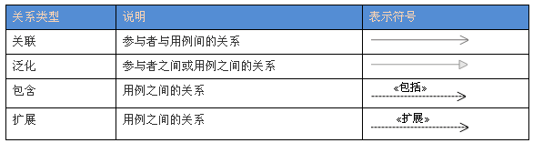

# 面向对象技术

## 基础理论

### 基本概念

面向对象 = 对象（Object）+ 分类（Classification）+ 继承（Inheritance）+ 通过消息的通信（Communication）

1. **对象**
   

对象是基本运行事的实体，既包括数据（属性），也包括作用于数据的操作（行为），即对象将属性和行为封装为一个实体。

对象是一个程序模块，而对用户来说，对象为他们提供所希望的行为。

2. **消息**

对象之间进行通信的构造称为消息。发送消息的对象不需要知道接受消息的对象如何对请求进行响应。

3. **类**

- 含义

类对**一组对象**的**共同特征**加以抽象并进行存储，它所包含的方法和数据描述一组对象的共同行为和属性。

类是对象之上的**抽象**，对象是类的具体化，是类的**实例**。

- 分类
    - 实体类：现实世界中真实的实体。
    - 接口类（边界类）：为用户提供一种与系统合作交互的方法。
    - 控制类：用来控制活动流，充当协调者。

4. **继承**

继承是父类和子类之间**共享**++数据++和++方法++的机制。

父类描述了子类的公共属性和方法，可以有多个子类，而子类都是父类的特例。

5. **多态**

多态是指不同的对象收到同一消息可以产生完全不同的结果，实现的细节由接收对象自行决定。

多态的实现收到继承的支持，通常把具有通用功能的消息存放在高层次，而不同的实现放在较低层次。

分类：
- 通用多态
    - 参数多态
    - 包含多态
- 特定多态
    - 过载多态
    - 强制多态

参数多态是最纯的多态。子类型化是包含多态的常见例子。
过载多态是指同一个名字在不同的上下文环境中具备不同的含义。

6. **动态绑定**

绑定是一个把过程调用和响应调用所需要执行的代码加以结合的过程。

- 静态绑定：**编译时**进行
- 动态绑定：**运行时**进行

**动态绑定**是和类的继承以及多态相联系的，一个给定的过程调用和代码的结合**直到调用**发生时才进行，根据接收对象的具体情况将请求的操作与实现的方法进行连接。

### 面向对象分析 

### 面向对象设计

#### 面向对象设计的活动

- 识别类及对象
- 定义属性
- 定义服务
- 识别关系
- 识别包

#### 面向对象设计的五大原则

- 单一责任原则
  
    > 让一个类只做一种类型责任
- 开放&封闭原则
  
    > 软件实体（包括类、模块、函数等）应该是可以扩展的，但是不可修改的。
- 里氏替换原则
  
    > 子类型必须能够替换掉他们的基类型。（在任何父类出现的地方，都可以用子类的实例来赋值给父类的引用）
- 依赖倒置原则
  
    > 抽象不应该依赖于细节，细节应该依赖于对象。
- 接口分离原则
  
    > 不应该强迫客户依赖于它们不用的方法（接口属于客户，不属于它所在的类层次结构）

> Robert C. Martin提出的其他原则
> - 重用发布等价原则-重用的粒度就是发布的粒度
> - 共同封闭原则-包中的所有类对于同一类性质的变化应该是共同封闭的
> - 共同重用原则-包中的所有类应该是共同重用的
> - 无环依赖原则-包的依赖关系图中不允许存在环
> - 稳定依赖原则-朝着稳定的方向进行依赖
> - 稳定抽象原则-包的抽象程度应该和其稳定程度一致

### 面向对象程序设计

类、继承&类层次结构、对象&消息传递&方法、对象自身引用、重置（覆盖）、类属类、无实例的类

### 面向对象测试

## UML-统一建模语言

统一建模语言（Unified Modeling Language，UML）是面向对象软件的**标准化建模语言**。

适用于企业信息系统、基于Web的分布式应用以及严格的实时嵌入式系统等。

包含**事物**、**关系**和**图**3种构造块。

### 事物

UML中包括：**结构事物**、**行为事物**、**分组事物**和**注释事物**4种事物。

#### 结构事物

类（Class）、接口（Interface）、协作（Collaboration）、用例（Use Case）、主动类（Active Class）、构件（Component）、制品（Artifact）、结点（Node）。

#### 行为事物

交互（Interaction）、状态机（State Machine）和活动（Activity）。

#### 分组事物

最主要的分组事物是包（Package）。

#### 注释事物

注解（Note）是一种主要的注释事物。

### 关系

UML中包括：**依赖**、**关联**、**泛化**和**实现**4中关系。

#### 1. 依赖

依赖（Dependency）是两个事物之间的语义关系，其中一个事物发生变化或影响另一个事物的语义。

依赖使用**虚线箭头**表示。

#### 2. 关联

关联（Association）是一种结构关系，描述了一组链，而链表示对象之间的连接。其中**聚集（Aggregation）**是一种特殊的关联，描述了整体和部分间的结构关系。

关联用**实线**表示，聚集用**末端带有空心菱形的实线**表示。关联上可以标注重复度和角色。

#### 3. 泛化

泛化（Generalization）是一种特殊/一般的关系，特殊元素（子元素）的对象可替代一般元素（父元素）的对象。

泛化使用**带有空心箭头的实线**表示，指向父元素。

#### 4. 实现

实现（Realization）是类元之间的语义关系，其中一个类元指定了由另一个类型保证执行的契约。两种情况：接口和实现它们的类或构件之间；用例和实现它们的协作之间。

实现使用**带有空心箭头的虚线**表示。

### 图

UML中的图包括类图、对象图、用例图、序列图、通信图、状态图、活动图、构件图、组合结构图、部署图、包图、交互概览图、计时图13种。

其中，序列图、通信图、交互概览图和计时图称为交互图。

#### 用例图

用例图（Use Case Diagram）展现了一组用例、参与者以及它们之间的关系。

用例图包含的内容，包括：

- 用例

- 参与者

- 关系

  

  - 关联：表示参与者与用例之间的通信，任何一方都可发送或接受消息
  - 泛化：指继承关系
  - 包含：一个用例可拆分成多个较小的步骤、
  - 扩展：表示一个用例是另一个用例功能的延伸

用例图示例：

### UML图的多重度

UML中关联的多重度是指一个类的实例能够与另一个类的多少个实例相关联。
多重度的取值：

- 0..1：0个或1个
- 1：只能是1个
- 0..*：0个或多个s
- *：0个或多个
- 1..*：1个或多个

